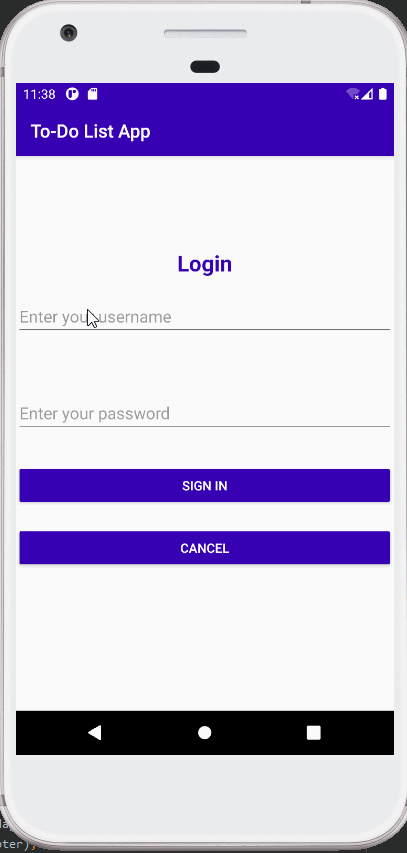

Before using the application, the user must first log in, 
which requires entering a 'Username' and a 'Password,' 
after which the user must press the sign in button to access
the application; however, if the user enters the wrong username
and password, the message 'invalid username or password' appears.
The user may also cancel the system login option if he or she does
not wish to join the app.When a correct username and password are
entered, the program presents two files with the titles "Demo Title"
and "Demo Summary." The object of the Demo Title is to identify the 
file. Additionally, there is a demo explanation option, which allows
the user to clarify and define the demo.And there's a date choice to
give the actual date of the demonstration, as well as a preference place
for the user to give their demo as a top priority. There is a button that
states "all changes are complete," which means that all options have been 
reviewed and the specifications have been fulfilled. After that, the user
must press the "update" button, which we include to update the details 
entered by the user.If the user does not wish to get any updates, he or she
should click the cancel button.After clicking the cancel button, a popup 
message appears, asking if you're sure you want to cancel the edit. 

There will be two options: cancel and ok. If you choose cancel, you will be 
taken to the same page where you will edit your file. If you choose ok, 
you will be taken back to the beginning tab.The three tiny buttons in the left
hand corner indicate the choices of "delete completed," "delete all," and "logout"
When a user selects Delete Done, a message appears asking, "Are you sure you want 
to delete completed task?" If the user selects OK, all files will be removed; but,
if the user selects Cancel, the files will not be deleted from the page.When the user
selects the Remove All option, all files in the tab are removed.When the user clicks
the logout button,the program will close and the user will be returned to the sign in page.